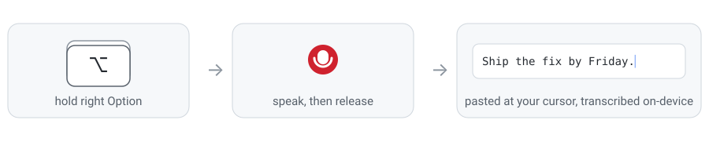

<div align="center">
  
  <h1>Sotto</h1>
  <p><em>sotto voce — under the breath</em></p>

  <p>
    
    
    
    <a href="https://github.com/utsavanand/sotto/actions/workflows/ci.yml"></a>
    <a href="LICENSE"></a>
  </p>
</div>

Hold a key anywhere on macOS, speak, release — your words are typed into
whatever app has focus. Dictation runs entirely on your Mac: Whisper
large-v3-turbo on the GPU via [Apple MLX](https://github.com/ml-explore/mlx),
no cloud, no account, no telemetry. The only network access is the one-time
model download.



## Features

- **Works everywhere** — any app that accepts paste: editors, browsers,
  terminals, Slack
- **On-device** — audio never leaves the machine; transcription works offline
- **Fast** — under 1.5 s from key-release to text on an M-series GPU
  (0.5 s typical on an M4 Max), with large-model accuracy
- **Menu bar status** — `…` loading · `🎙` ready · `🔴` recording
- **Recording indicator** — floating pill with a live mic level animation
  while the hotkey is held
- **History** — every transcript saved locally; browse in 🎙 → History…,
  or click a recent one in the menu to copy it
- **Self-diagnosing** — every dictation logs its mic, duration, signal level,
  latency, and transcript to `~/Library/Logs/Sotto.log`
- **Small** — one Python file, four dependencies, no config files

## Install

Requires an Apple Silicon Mac and Python 3.10+ (`brew install python`).

```sh
git clone https://github.com/utsavanand/sotto && cd sotto
./install.sh
open /Applications/Sotto.app
```

`install.sh` builds `Sotto.app` on your machine: a Python environment in
`~/Library/Application Support/Sotto` plus an ad-hoc-signed app bundle in
`/Applications`. Locally built means no Gatekeeper warnings and nothing to
notarize.

Then grant **Sotto** in System Settings → Privacy & Security — both,
then relaunch the app:

| Permission | Why |
|---|---|
| Microphone | recording while the hotkey is held |
| Accessibility | observing the global hotkey, sending the paste |

First launch downloads the model (~1.6 GB, cached in `~/.cache/huggingface`;
watch progress via menu bar → Open Log). After that, startup takes a few
seconds. To run at login: System Settings → General → Login Items → add Sotto.

## Usage

1. Put your cursor where the text should go
2. Hold <kbd>⌥ right Option</kbd> — the menu bar icon turns 🔴
3. Speak (give it a beat after pressing; the mic takes a moment to open)
4. Release — the transcription is pasted at your cursor

## FAQ

**The hotkey does nothing.**
Almost always permissions: check that *Sotto* (not your terminal) is enabled
under Accessibility, then relaunch it. Re-running `install.sh` rebuilds the
bundle and can reset the grant.

**It suddenly stopped working everywhere.**
Some app is holding macOS *secure input* (password fields, `sudo` prompts,
Keychain dialogs block global key observation by design — usually it's a
terminal that never released it). Close that app or its window.

**I'm wearing AirPods and the transcripts were wrong.**
Fixed by design: Sotto always records from the built-in microphone. Bluetooth
mics switch to a low-quality codec when recording starts and lose ~1 s of
audio during the switch, garbling the start of every dictation.

**It typed "Thank you." when I said nothing.**
Whisper hallucinates on silence. Holds under 0.3 s are dropped, but a longer
silent hold can still produce one of these.

**Why did my clipboard change?**
Sotto pastes by writing the transcript to the clipboard and sending
<kbd>⌘V</kbd>. Overwriting is deliberate — restoring the old clipboard has a
race that can paste stale content into slow apps (see
[DESIGN.md](DESIGN.md)). Note that clipboard managers will record every
dictation.

**Can I change the hotkey or the model?**
Both are constants at the top of `sotto.py`; re-run `./install.sh` after
editing. Smaller models (e.g. `mlx-community/whisper-small-mlx`) trade
accuracy for speed and memory.

## Privacy

Audio is captured only while the hotkey is held, processed in memory, and
never written to disk or sent anywhere. The transcript goes to the clipboard,
the local log file, and the local history file
(`~/Library/Application Support/Sotto/history.jsonl`) — delete either any
time. The model is fetched once from Hugging Face; nothing else touches the
network.

## Development

```sh
python3 -m venv .venv && .venv/bin/pip install -r requirements.txt
./run.sh    # runs from the repo, logs to the terminal
```

Architecture, trade-offs, and the design review that shaped them:
[DESIGN.md](DESIGN.md). Contributions: [CONTRIBUTING.md](CONTRIBUTING.md).

## Uninstall

```sh
rm -rf /Applications/Sotto.app ~/Library/Logs/Sotto.log
rm -rf "$HOME/Library/Application Support/Sotto"
```

The cached model lives in `~/.cache/huggingface` if you want that gone too.

## Acknowledgments

Built on [mlx-whisper](https://github.com/ml-explore/mlx-examples),
[sounddevice](https://github.com/spatialaudio/python-sounddevice), and
[PyObjC](https://github.com/ronaldoussoren/pyobjc). Interaction model
inspired by [Wispr Flow](https://wisprflow.ai).

## License

[MIT](LICENSE)
