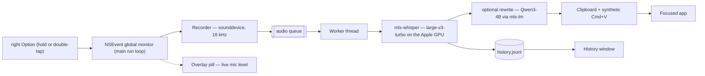

<div align="center">
  
  <h1>Sotto</h1>
  <p><em>sotto voce — under the breath</em></p>

  <p>
    
    
    
    <a href="https://github.com/utsavanand/sotto/actions/workflows/ci.yml"></a>
    <a href="https://github.com/utsavanand/sotto/releases/latest"></a>
    <a href="LICENSE"></a>
  </p>
</div>

Hold a key anywhere on macOS, speak, release — your words are typed into
whatever app has focus. Dictation runs entirely on your Mac: Whisper
large-v3-turbo on the GPU via [Apple MLX](https://github.com/ml-explore/mlx),
no cloud, no account, no telemetry. The only network access is the one-time
model download.


## Features

- **Works everywhere** — any app that accepts paste: editors, browsers,
  terminals, Slack
- **On-device** — audio never leaves the machine; transcription works offline
- **Fast** — under 1.5 s from key-release to text on an M-series GPU
  (0.5 s typical on an M4 Max), with large-model accuracy
- **Menu bar status** — `…` loading · `🎙` ready · `🔴` recording
- **Recording indicator** — floating pill with a live mic level animation,
  normalized against ambient noise so only speech moves the bars
- **Hands-free mode** — double-tap the hotkey to lock recording, tap to stop
- **Pick your hotkey** — 🎙 → Hotkey: right Option (default), right Command,
  right Control, or right Shift; saved across launches
- **Optional rewrite** — 🎙 → Rewrite runs the transcript through a local
  Qwen3-4B before pasting: *Clean up* strips filler words and false starts,
  *Bullet points* turns rambles into notes — both on-device, ~0.5 s extra
- **History** — every transcript saved locally; browse in 🎙 → History…,
  or click a recent one in the menu to copy it
- **Self-diagnosing** — every dictation logs its mic, duration, signal level,
  latency, and transcript to `~/Library/Logs/Sotto.log`
- **Report a bug** — 🎙 → Report a Bug… opens a pre-filled email draft with
  version/mic/settings diagnostics and the log attached; nothing is sent
  until you review and hit send
- **Small** — one Python file, five dependencies, one JSON settings file

## Install

Requires an Apple Silicon Mac on macOS 14 or newer, and Python 3.13 — that
exact minor version, because the lock file pins hash-verified 3.13 wheels.

On a fresh Mac, two one-time steps first:

```sh
# 1. Homebrew (also installs git via the Xcode Command Line Tools)
/bin/bash -c "$(curl -fsSL https://raw.githubusercontent.com/Homebrew/install/HEAD/install.sh)"
# then run the one or two `eval` lines the installer prints at the end,
# so `brew` is on your PATH

# 2. Python 3.13
brew install python@3.13
```

`install.sh` finds the interpreter as `python3.13`, so it doesn't matter
what plain `python3` points to on your machine.

Then:

```sh
git clone https://github.com/utsavanand/sotto && cd sotto
./install.sh
open /Applications/Sotto.app
```

`install.sh` builds `Sotto.app` on your machine: a Python environment in
`~/Library/Application Support/Sotto` plus an ad-hoc-signed app bundle in
`/Applications`. Locally built means no Gatekeeper warnings and nothing to
notarize.

Then grant **Sotto** in System Settings → Privacy & Security — both,
then relaunch the app:

| Permission | Why |
|---|---|
| Microphone | recording while the hotkey is held |
| Accessibility | observing the global hotkey, sending the paste |

First launch downloads the model (~1.6 GB, cached in `~/.cache/huggingface`;
watch progress via menu bar → Open Log). After that, startup takes a few
seconds. To run at login: System Settings → General → Login Items → add Sotto.

## Usage

**Hold to talk** — put your cursor where the text should go, hold
<kbd>⌥ right Option</kbd>, speak, release. The transcription is pasted at
your cursor. A floating pill at the bottom of the screen shows the live mic
level while recording.

**Hands-free** — double-tap <kbd>⌥ right Option</kbd> to lock recording on,
speak as long as you like, then tap once to stop and paste.

**Rewrite** (off by default) — 🎙 → Rewrite → *Clean up* removes filler words
(um, uh, like, you know), false starts, and repeated words, and fixes
punctuation — your wording stays intact. *Bullet points* turns a dictated
ramble into a tidy list. Rewriting runs a second on-device model
(Qwen3-4B-Instruct, ~2.3 GB downloaded the first time you switch it on) and
adds roughly half a second before the paste. If the model isn't loaded yet,
the raw transcript is pasted and the log says so.

## FAQ

**Where do I see everything I've dictated?**
🎙 → History…, or — if the menu bar icon is hidden behind the notch — just
launch Sotto again (Launchpad, Finder, or `open /Applications/Sotto.app`)
while it's running: the History window opens.

**The hotkey does nothing.**
Almost always permissions: check that *Sotto* (not your terminal) is enabled
under Accessibility, then relaunch it. Re-running `install.sh` rebuilds the
bundle and can reset the grant.

**It suddenly stopped working everywhere.**
Some app is holding macOS *secure input* (password fields, `sudo` prompts,
Keychain dialogs block global key observation by design — usually it's a
terminal that never released it). Close that app or its window.

**I'm wearing AirPods and the transcripts were wrong.**
Fixed by design: Sotto always records from the built-in microphone. Bluetooth
mics switch to a low-quality codec when recording starts and lose ~1 s of
audio during the switch, garbling the start of every dictation.

**It typed "Thank you." when I said nothing.**
Whisper hallucinates on silence. Holds under 0.3 s are dropped, but a longer
silent hold can still produce one of these.

**Why did my clipboard change?**
Sotto pastes by writing the transcript to the clipboard and sending
<kbd>⌘V</kbd>. Overwriting is deliberate — restoring the old clipboard has a
race that can paste stale content into slow apps (see
[DESIGN.md](DESIGN.md)). Note that clipboard managers will record every
dictation.

**Can I change the hotkey?**
🎙 → Hotkey. Only right-side modifier keys are offered: the left ones are
needed for typing special characters and app shortcuts.

**Can I change the model?**
The Whisper and rewrite models are constants at the top of `sotto.py`; re-run
`./install.sh` after editing. Smaller models (e.g.
`mlx-community/whisper-small-mlx`) trade accuracy for speed and memory.

## Architecture



The hotkey handler and UI live on the main run loop; recording callbacks and
transcription run off it (audio thread, worker thread) so a slow inference can
never stall key handling. Why NSEvent instead of a CGEventTap, why the
built-in mic is forced, and the rest of the trade-offs: [DESIGN.md](DESIGN.md).

## Privacy

Audio is captured only while the hotkey is held, processed in memory, and
never written to disk or sent anywhere. The transcript goes to the clipboard,
the local log file, and the local history file
(`~/Library/Application Support/Sotto/history.jsonl`) — delete either any
time. Rewriting, when enabled, also runs entirely on-device. The models are
fetched once from Hugging Face; nothing else touches the network.

## Development

```sh
python3.13 -m venv .venv && .venv/bin/pip install -r requirements.txt
./run.sh    # runs from the repo, logs to the terminal
```

Architecture, trade-offs, and the design review that shaped them:
[DESIGN.md](DESIGN.md). Contributions: [CONTRIBUTING.md](CONTRIBUTING.md).

## Uninstall

```sh
rm -rf /Applications/Sotto.app ~/Library/Logs/Sotto.log
rm -rf "$HOME/Library/Application Support/Sotto"
```

The cached model lives in `~/.cache/huggingface` if you want that gone too.

## Acknowledgments

Built on [mlx-whisper](https://github.com/ml-explore/mlx-examples),
[mlx-lm](https://github.com/ml-explore/mlx-lm),
[sounddevice](https://github.com/spatialaudio/python-sounddevice), and
[PyObjC](https://github.com/ronaldoussoren/pyobjc). Interaction model
inspired by [Wispr Flow](https://wisprflow.ai).

## License

[MIT](LICENSE)
