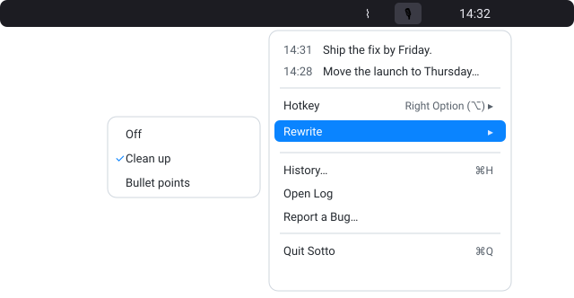
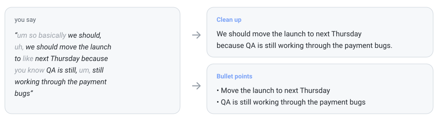
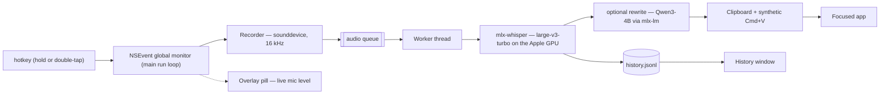

<div align="center">
  
  <h1>Sotto</h1>
  <p><em>sotto voce — under the breath</em></p>

  <p>
    
    
    
    <a href="https://github.com/utsavanand/sotto/actions/workflows/ci.yml"></a>
    <a href="https://github.com/utsavanand/sotto/releases/latest"></a>
    <a href="LICENSE"></a>
  </p>
</div>

Hold a key anywhere on macOS, speak, release — your words are typed into
whatever app has focus. Everything runs on your Mac via
[Apple MLX](https://github.com/ml-explore/mlx): no cloud, no account, no
telemetry.


- **Works everywhere** — any app that accepts paste
- **Fast** — under 1.5 s from key-release to text (0.5 s typical on an M4 Max),
  with Whisper large-v3-turbo accuracy
- **Hands-free** — double-tap the hotkey to lock recording, tap to stop
- **Recording pill** — floating mic-level indicator with an elapsed timer,
  then live progress ("Transcribing…", "Rewriting…", "Pasted") so you always
  know what it's doing
- **On-device** — audio never leaves the machine; works offline
- **Small** — one Python file, five dependencies

## The menu

Recent transcripts (click to copy), your hotkey, rewrite mode, history,
log, and one-click bug reports:



- **Settings…** — a real window (⌘,) for hotkey and rewrite mode, so they
  stay reachable even when a full menu bar hides the icon behind the notch
- **Hotkey** — right Option (default), right Command, right Control, or right
  Shift. Right-side only: the left keys are needed for typing.
- **Report a Bug…** — opens a pre-filled Mail draft with diagnostics and the
  log attached; nothing sends until you review it.

## Rewrite (optional)

A second on-device model (Qwen3-4B-Instruct, ~2.3 GB on first enable,
~0.5 s per dictation) polishes the transcript before it's pasted. Three
modes: **Clean up** keeps your wording and strips filler, **Structured**
gives the dictation the shape it needs (crisp prose, bullets for parallel
items, numbered steps for a sequence), and **Caveman** compresses hard for
pasting into an AI assistant — one line, every instruction kept, the words and
formatting around them cut.



Off by default. If the model isn't loaded yet or a rewrite fails, the raw
transcript is pasted — you never lose words.

## Install

Requires an Apple Silicon Mac on macOS 14+, and Python 3.13 — that exact
minor version, because the lock file pins hash-verified 3.13 wheels.

On a fresh Mac, two one-time steps first:

```sh
# 1. Homebrew (also installs git via the Xcode Command Line Tools)
/bin/bash -c "$(curl -fsSL https://raw.githubusercontent.com/Homebrew/install/HEAD/install.sh)"
# then run the eval line(s) the installer prints, so `brew` is on your PATH

# 2. Python 3.13
brew install python@3.13
```

Then:

```sh
git clone https://github.com/utsavanand/sotto && cd sotto
./install.sh
open /Applications/Sotto.app
```

`install.sh` builds `Sotto.app` locally (hash-verified Python environment +
ad-hoc-signed bundle), so there are no Gatekeeper warnings. Grant both
permissions in System Settings → Privacy & Security, then relaunch:

| Permission | Why |
|---|---|
| Microphone | recording while the hotkey is held |
| Accessibility | observing the global hotkey, sending the paste |

First launch downloads the Whisper model (~1.6 GB; watch progress via
🎙 → Open Log). To run at login: System Settings → General → Login Items.

## Usage

Put your cursor where the text should go, hold <kbd>⌥ right Option</kbd>,
speak, release. Double-tap instead to record hands-free; tap once to stop.
Everything else lives in the 🎙 menu.

## FAQ

<details>
<summary><strong>Where do I see everything I've dictated?</strong></summary>

🎙 → History…, or — if the menu bar icon is hidden behind the notch — just
launch Sotto again (Launchpad, Finder, or `open /Applications/Sotto.app`)
while it's running: the History window opens.
</details>

<details>
<summary><strong>The hotkey does nothing.</strong></summary>

Almost always permissions: check that *Sotto* (not your terminal) is enabled
under Accessibility, then relaunch it. Re-running `install.sh` rebuilds the
bundle and can reset the grant. Also make sure you're pressing the key shown
in 🎙 → Hotkey — it's the **right**-side key.
</details>

<details>
<summary><strong>It suddenly stopped working everywhere.</strong></summary>

Some app is holding macOS *secure input* (password fields, `sudo` prompts,
and Keychain dialogs block global key observation by design — usually it's a
terminal that never released it). Close that app or its window.
</details>

<details>
<summary><strong>I'm wearing AirPods and the transcripts were wrong.</strong></summary>

Fixed by design: Sotto always records from the built-in microphone. Bluetooth
mics switch to a low-quality codec when recording starts and lose ~1 s of
audio during the switch, garbling the start of every dictation.
</details>

<details>
<summary><strong>It typed "Thank you." when I said nothing.</strong></summary>

Whisper hallucinates on silence. Holds under 0.3 s are dropped, but a longer
silent hold can still produce one of these.
</details>

<details>
<summary><strong>Why did my clipboard change?</strong></summary>

Sotto pastes by writing the transcript to the clipboard and sending
<kbd>⌘V</kbd>. Overwriting is deliberate — restoring the old clipboard has a
race that can paste stale content into slow apps (see
[DESIGN.md](DESIGN.md)). Clipboard managers will record every dictation.
</details>

<details>
<summary><strong>Can I change the models?</strong></summary>

The Whisper and rewrite models are constants at the top of `sotto.py`; re-run
`./install.sh` after editing. Smaller models (e.g.
`mlx-community/whisper-small-mlx`) trade accuracy for speed and memory.
</details>

## Architecture



The hotkey handler and UI live on the main run loop; recording and inference
run off it, so a slow transcription can never stall key handling. The full
trade-off discussion: [DESIGN.md](DESIGN.md).

## Privacy

Audio is captured only while the hotkey is held, processed in memory, never
written to disk or sent anywhere. Transcripts go to the clipboard, the local
log, and the local history file (`~/Library/Application Support/Sotto/`) —
delete them any time. Rewriting runs entirely on-device too. The models are
fetched once from Hugging Face; nothing else touches the network.

## Development

```sh
python3.13 -m venv .venv && .venv/bin/pip install -r requirements.txt
./run.sh    # runs from the repo, logs to the terminal
```

Design rationale: [DESIGN.md](DESIGN.md) · Contributing:
[CONTRIBUTING.md](CONTRIBUTING.md)

## Uninstall

```sh
rm -rf /Applications/Sotto.app ~/Library/Logs/Sotto.log
rm -rf "$HOME/Library/Application Support/Sotto"
```

The cached models live in `~/.cache/huggingface` if you want those gone too.

## Acknowledgments

Built on [mlx-whisper](https://github.com/ml-explore/mlx-examples),
[mlx-lm](https://github.com/ml-explore/mlx-lm),
[sounddevice](https://github.com/spatialaudio/python-sounddevice), and
[PyObjC](https://github.com/ronaldoussoren/pyobjc). Interaction model
inspired by [Wispr Flow](https://wisprflow.ai).

## License

[MIT](LICENSE)
